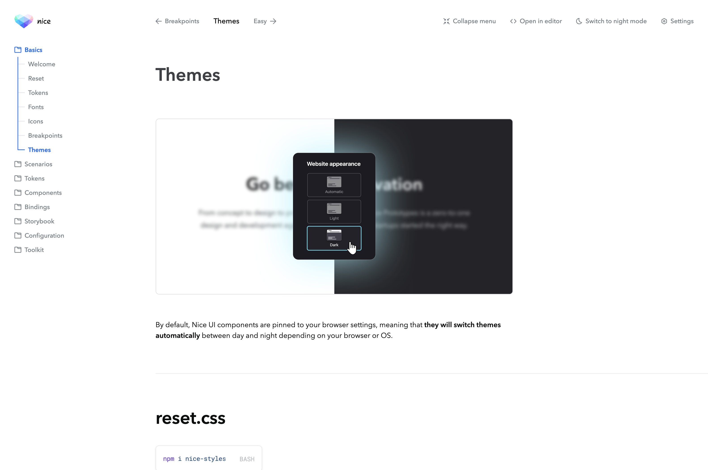
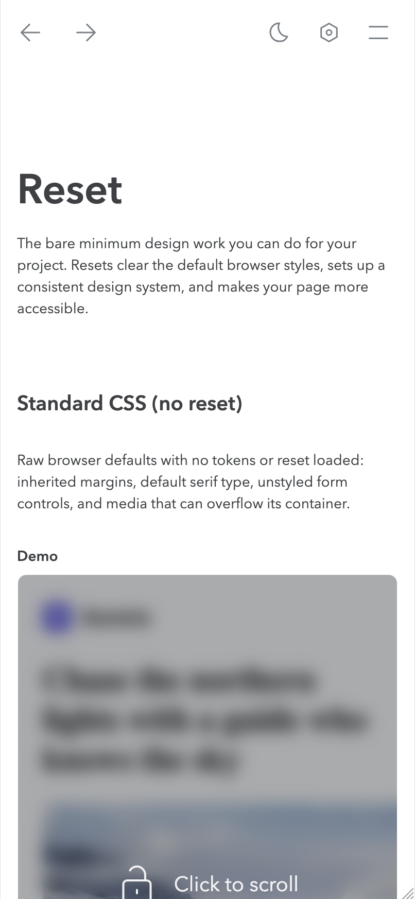

# nice-storybook-theme

A Storybook addon for the Nice design system that restyles the **manager
sidebar tree**:

- Folder glyphs and depth/selection-aware tree lines at any nesting depth, drawn
  from Nice design tokens (so they flip with the theme).
- Collapsible top-level sections and a hidden search.
- A `tagSidebarPaths` engine that injects a guide strip into each row — one
  `aria-hidden` cell per depth level, each tagged with the connector it draws
  (`data-branch`) and whether the path to the open story runs through it
  (`data-path`) — plus the selection ancestry (`data-selected-group`), for the
  stylesheet to read.

It touches only the sidebar; the consumer keeps ownership of the manager theme
and branding.

## Screens

The sidebar tree at desktop width: folder glyphs on the sections, branch
connectors down the open one, and the line reading as active only along the path
to the selected page.



Below tablet the sidebar moves behind Storybook's own mobile menu, leaving the
manager chrome the addon also restyles.



## Install

```bash
npm install -D nice-storybook-theme
```

Requires (peers): `storybook` ≥ 10 and `storybook-dark-mode` ≥ 5. Renders with
Nice tokens (`nice-styles`) and the Nice folder icon (`nice-icons`).

## Wire it up

`.storybook/main.ts`:

```ts
const config = {
  addons: [
    "storybook-dark-mode",
    "nice-storybook-theme", // loads its manager entry
  ],
}
export default config
```

The consumer's manager must provide the Nice `--np--*` token variables (e.g. via
the Nice manager theming) for the sidebar to pick up its colors.

## Caveat

The sidebar styling depends on Storybook's **private** sidebar DOM
(`.sidebar-item`, `data-nodetype`, `[tabindex] > div > svg`, …),
verified against **Storybook 10**. A Storybook internal change can require
updating the selectors in `src/styles/managerSidebarCss.ts` and
`src/manager/glyphs.ts`.

## License

MIT
